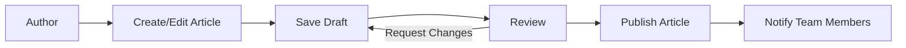
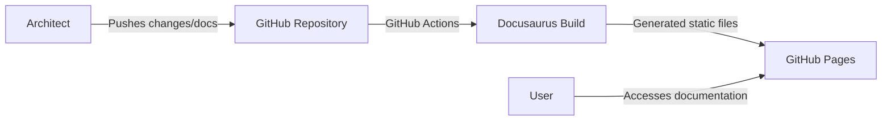

# Document repository

Key features to consider when choosing a document repository.

| Requirement                | Description                                                                                           |
|:---------------------------|:------------------------------------------------------------------------------------------------------|
| Ease of use                | Intuitive user interface and minimal learning curve                                                   |
| Collaboration features     | Real-time collaboration, version control, and easy sharing of artifacts                               |
| Integration capabilities   | Integration with existing tools and platforms used by the architecture team                          |
| Scalability                | Ability to handle growing needs, such as users, projects, or storage capacity                         |
| Security and access control| Robust security features, data encryption, secure authentication, and granular access control         |
| Customization              | Customization of workflows, processes, metadata, templates, and reporting                             |
| Versioning and history     | Support for artifact versioning, change tracking, and rollback to previous versions                   |
| Search and navigation      | Powerful search capabilities and easy navigation                                                      |
| Industry standards support | Support for common architecture frameworks and notations, such as TOGAF, ArchiMate, or UML           |
| Vendor support and community| Level of vendor support and active user community for troubleshooting and staying up-to-date          |
| Cost                       | Total cost of ownership, including licensing, maintenance, customization, and integration expenses   |
| Cloud-based or on-premises | Choice between cloud-based or on-premises deployment based on security, compliance, and infrastructure|

We can consider the following two products as a document repository for technical documentation.

* Atlassian Confluence
* Gitlab + Docusaurus

## Feature comparision between Confluence & Docusaurus

| Feature                    | Docusaurus                                          | Confluence                                      |
|:---------------------------|:----------------------------------------------------|:------------------------------------------------|
| Purpose                    | Static site generator for documentation websites    | Collaborative content management platform      |
| Open Source                | Yes                                                 | No                                              |
| Cost                       | Free                                                | Paid (pricing depends on users and deployment)  |
| Hosting                    | Self-hosted or any static site hosting provider     | Cloud or self-hosted (Server/Data Center)      |
| Markdown Support           | Yes                                                 | Limited, native format is Atlassian's own markup|
| Versioning                 | Supports versioning of documentation                | Page history and versioning                     |
| Collaboration              | Through version control system (e.g., Git)          | Real-time collaboration and commenting          |
| Customization              | Highly customizable through themes and plugins      | Customizable themes and layouts                 |
| Search                     | Built-in search (powered by Algolia, if enabled)    | Built-in search                                 |
| Integrations               | Limited, mostly through plugins and customizations  | Numerous integrations with Atlassian ecosystem  |
| Content Management         | Managed via files and folders in version control    | Web-based content management                    |
| Internationalization (i18n)| Supports multiple languages for documentation       | Supports multiple languages for interface       |
| Access Control             | Managed via version control or hosting platform     | Built-in granular access control                |
| Ease of Setup              | Straightforward setup with CLI and configuration    | More complex setup, especially for self-hosting |
| Developer Focus            | Primarily targeted at developers and technical docs | Targeted at various teams and departments       |

## Article publishing workflow on Confluence

The following graph represents the steps for publishing architecture documents in Atlassian Confluence.

## Article publishing workflow on Docusaurus with GitHub

The following graph represents the steps for publishing architecture documents in a Docusaurus website using GitHub repository and Github pages.

